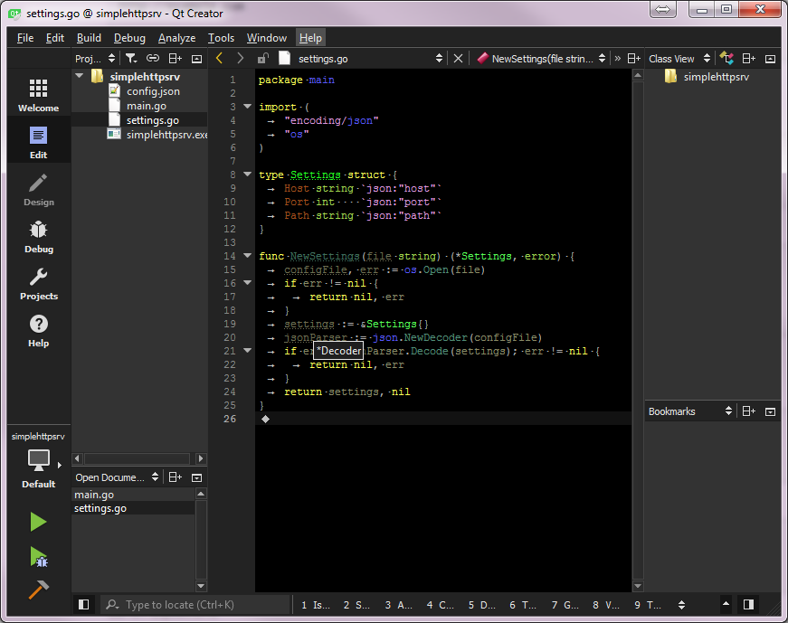
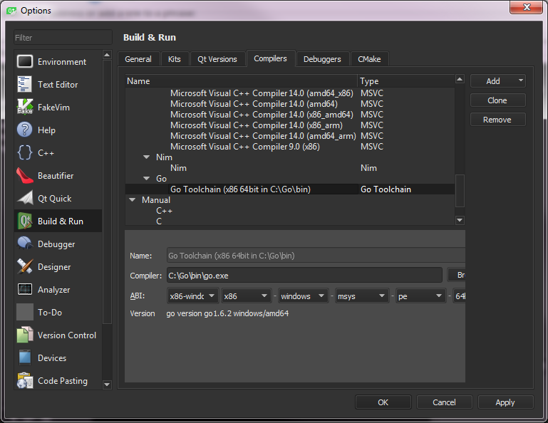
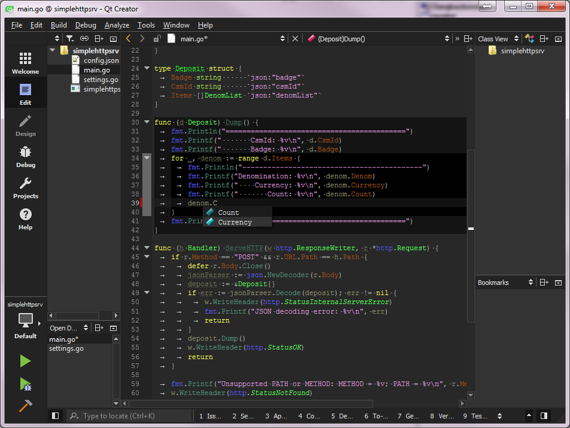
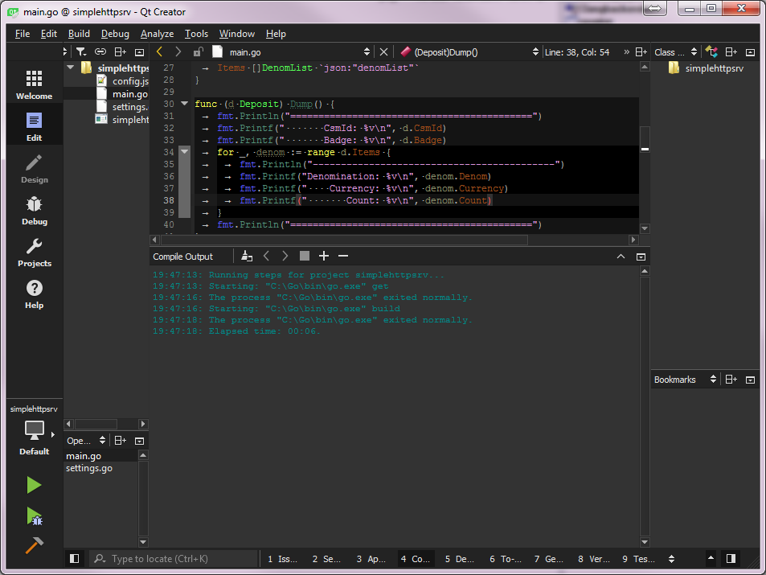
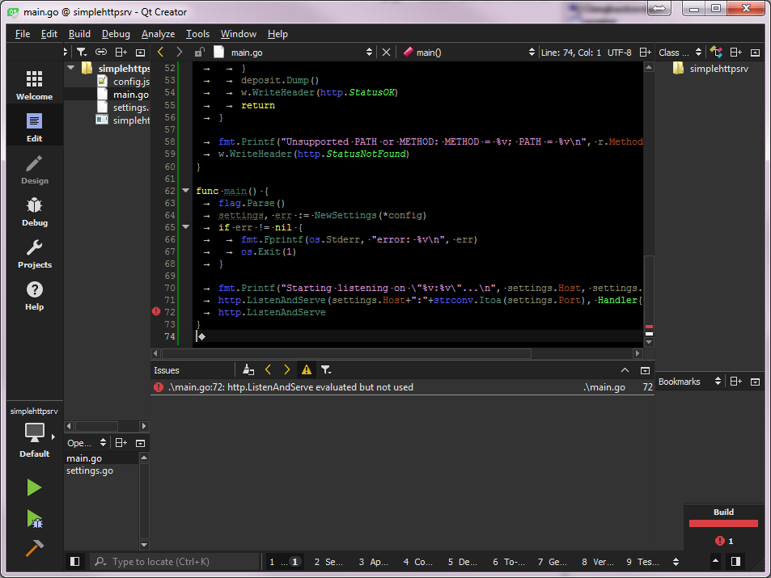

# Qt Creator

Qt Creator is a cross-platform IDE for development with the Qt framework.

## Fork reason

The goal of the fork is to support GoLang programming language.

Features:
* Go-project
* Go-toolchain (run, build and issues are supported)
* Editor for Go-sources
    * Semantic Highlighting
    * Autocompletion
    * Go to definition
    * Type tooltips on overhandling

Some screenshots:

## Supported Platforms

The standalone binary packages support the following platforms:

* Windows 7 or later
* (K)Ubuntu Linux 16.04 (64-bit) or later
* macOS 10.8 or later

## Compiling Qt Creator

Prerequisites:

* Qt 5.6.0 or later
* Qt WebEngine module for QtWebEngine based help viewer
* On Windows:
    * ActiveState Active Perl
    * MinGW with g++ 4.9 or Visual Studio 2015 or later
    * jom
* On Mac OS X: latest Xcode
* On Linux: g++ 4.9 or later
* LLVM/Clang 3.9.0 or later (optional, needed for the Clang Code Model, see the
  section "Get LLVM/Clang for the Clang Code Model")
    * CMake (only for manual builds of LLVM/Clang)
* Qbs 1.7.x (optional, sources also contain Qbs itself)

The installed toolchains have to match the one Qt was compiled with.

You can build Qt Creator with

    # Optional, needed for the Clang Code Model:
    export LLVM_INSTALL_DIR=/path/to/llvm (or "set" on Windows)
    # Optional, needed to let the QbsProjectManager plugin use system Qbs:
    export QBS_INSTALL_DIR=/path/to/qbs

    cd $SOURCE_DIRECTORY
    qmake -r
    make (or mingw32-make or nmake or jom, depending on your platform)

Installation ("make install") is not needed. It is however possible, using

    make install INSTALL_ROOT=$INSTALL_DIRECTORY

## Compiling Qt and Qt Creator on Windows

This section provides step by step instructions for compiling the latest
versions of Qt and Qt Creator on Windows. Alternatively, to avoid having to
compile Qt yourself, you can use one of the versions of Qt shipped with the Qt
SDK (release builds of Qt using MinGW and Visual C++ 2015 or later).
For detailed information on the supported compilers, see
<https://wiki.qt.io/Building_Qt_5_from_Git> .

   1.  Decide which compiler to use: MinGW or Microsoft Visual Studio. If you
       plan to contribute to Qt Creator, you should compile your changes with
       both compilers.

   2.  Install Git for Windows from <https://git-for-windows.github.io/>. If you plan to
       use the MinGW compiler suite, do not choose to put git in the
       default path of Windows command prompts. For more information, see
       step 9.

   3.  Create a working directory under which to check out Qt and Qt Creator,
       for example, `c:\work`. If you plan to use MinGW and Microsoft Visual
       Studio simultaneously or mix different Qt versions, we recommend
       creating a directory structure which reflects that. For example:
       `C:\work\qt5.6.0-vs12, C:\work\qt5.6.0-mingw`.

   4.  Download and install Perl from <https://www.activestate.com/activeperl>
       and check that perl.exe is added to the path. Run `perl -v` to verify
       that the version displayed is 5.10 or later. Note that git ships
       an outdated version 5.8 which cannot be used for Qt.

   5.  In the working directory, check out the respective branch of Qt from
       <https://code.qt.io/cgit/qt/qt5.git> (we recommend the latest released version).

   6.  Check out Qt Creator (master branch or latest version, see
       <https://code.qt.io/cgit/qt-creator/qt-creator.git>).
       You should now have the directories qt and creator under your working
       directory.

   7.  Install a compiler:
       - For a MinGW toolchain for Qt, see <https://wiki.qt.io/MinGW> .

       - For Microsoft Visual C++, install the Windows SDK and the "Debugging
         Tools for Windows" from the SDK image. We strongly recommend using the
         64-bit version and 64-bit compilers on 64-bit systems.

         For the Visual C++ compilers, it is recommended to use the tool 'jom'.
         It is a replacement for nmake that utilizes all CPU cores and thus
         speeds up compilation significantly. Download it from
         <https://download.qt.io/official_releases/jom>
         and add the executable to the path.

   8.  For convenience, we recommend creating shell prompts with the correct
       environment. This can be done by creating a .bat-file
       (such as, `<working_directory>\qtvars.bat`) that contains the environment
       variable settings.
       A `.bat`-file for MinGW looks like:

         set PATH=<path_to_qt>\[qtbase\]bin;<path_to_mingw>\bin;<working_directory>\creator\bin;%PATH%
         set QMAKESPEC=win32-g++

       For the Visual C++ compilers, call the `.bat` file that sets up the
       environment for the compiler (provided by the Windows SDK or the
       compiler):

         CALL "C:\Program Files (x86)\Microsoft Visual Studio 14.0\VC\vcvarsall.bat" amd64
         set PATH=<path_to_qt>\[qtbase\]bin;<working_directory>\creator\bin;%PATH%
         set QMAKESPEC=win32-msvc2013

       You can create desktop links to the `.bat` files using the working
       directory and specifying

        %SystemRoot%\system32\cmd.exe /E:ON /V:ON  /k <working_directory>\qtvars.bat

   9.  When using MinGW, open the shell prompt and enter:

        sh.exe

       That should result in a `sh is not recognized as internal or external
       command...` error. If a `sh.exe` is found, the compile process will fail.
       You have to remove it from the path.

   10. To make use of the Clang Code Model:

       * Install LLVM/Clang - see the section "Get LLVM/Clang for the Clang
         Code Model".
       * Set the environment variable LLVM_INSTALL_DIR to the LLVM/Clang
         installation directory.
       * When you launch Qt Creator, activate the Clang Code Model plugin as
         described in doc/src/editors/creator-clang-codemodel.qdoc.

   11. You are now ready to configure and build Qt and Qt Creator.
       Please see <https://wiki.qt.io/Building_Qt_5_from_Git> for
       recommended configure-options for Qt 5.
       To use MinGW, open the the shell prompt and enter:

         cd <path_to_qt>
         configure <configure_options> && mingw32-make -s
         cd ..\creator
         qmake && mingw32-make -s

       To use the Visual C++ compilers, enter:

         cd <path_to_qt>
         configure <configure_options> && jom
         cd ..\creator
         qmake && jom

   12. To launch Qt Creator, enter:
       qtcreator

   13. To test the Clang-based code model, verify that backend process
         bin\clangbackend.exe
       launches (displaying its usage).

       The library libclang.dll needs to be copied to the bin directory if
       Clang cannot be found in the path.

   14. When using  Visual C++ with the "Debugging Tools for Windows" installed,
       the extension library `qtcreatorcdbext.dll` to be loaded into the
       Windows console debugger (`cdb.exe`) should have been built under
       `lib\qtcreatorcdbext32` or `lib\qtcreatorcdbext64`.
       When using a 32 bit-build of Qt Creator with the 64 bit version of the
       "Debugging Tools for Windows" the library should also be built with
       a 64 bit compiler (rebuild `src\libs\qtcreatorcdbext` using a 64 bit
       compiler).

       If you are building 32 bit and running on a 64 bit
       Windows, you can obtain the 64 bit versions of the extension library
       and the binary `win64interrupt.exe`, which is required for
       debugging from the repository
       <https://code.qt.io/cgit/qt-creator/binary-artifacts.git/tree> .

   15. Qt Creator can be registered as a post-mortem debugger. This
       can be done in the options page or by running the tool qtcdebugger
       with administrative privileges passing the command line options
       -register/unregister, respectively. Alternatively,
       the required registry entries

        HKEY_LOCAL_MACHINE\SOFTWARE\Microsoft\Windows NT\CurrentVersion\AeDebug
        HKEY_LOCAL_MACHINE\SOFTWARE\Wow6432Node\Microsoft\Windows NT\CurrentVersion\AeDebug

       can be modified using the registry editor regedt32 to contain

        <path>\qt-creator\bin\qtcdebugger %ld %ld

       When using a self-built version of Qt Creator as post-mortem debugger, it needs to be
       able to find all dependent Qt-libraries and plugins when being launched by the
       system. The easiest way to provide them for Qt 5 is to run the tool windeployqt:

        windeployqt -quick -qmldir share\qtcreator\welcomescreen -qmldir src\plugins\qmlprofiler bin\qtcreator.exe lib\qtcreator lib\qtcreator\plugins

Note that unlike on Unix, you cannot overwrite executables that are running.
Thus, if you want to work on Qt Creator using Qt Creator, you need a
separate build of it. We recommend using a separate, release-built version
of Qt and Qt Creator to work on a debug-built version of Qt and Qt Creator
or using shadow builds.

## Get LLVM/Clang for the Clang Code Model

The Clang Code Model depends on the LLVM/Clang libraries. The currently
supported LLVM/Clang version is 3.9.

### Prebuilt LLVM/Clang packages

Prebuilt packages of LLVM/Clang can be downloaded from

    https://download.qt.io/development_releases/prebuilt/libclang/

This should be your preferred option because you will use the version that is
shipped together with Qt Creator. In addition, the packages for Windows are
faster due to profile-guided optimization. If the prebuilt packages do not
match your configuration, you need to build LLVM/Clang manually.

If you use GCC 5 or higher on Linux, please do not use our LLVM package, but get
the package for your distribution. Our LLVM package is compiled with GCC 4, so
you get linking errors, because GCC 5 is using a C++ 11 conforming string
implementation, which is not used by GCC 4. To sum it up, do not mix GCC 5 and
GCC 4 binaries. On Ubuntu, you can download the package from
http://apt.llvm.org/ with:

   wget -O - http://apt.llvm.org/llvm-snapshot.gpg.key | sudo apt-key add -
   sudo apt-add-repository "deb http://apt.llvm.org/`lsb_release -cs`/ llvm-toolchain-`lsb_release -cs`-3.9 main"
   sudo apt-get update
   sudo apt-get install llvm-3.9 libclang-3.9-dev

There is a workaround to set _GLIBCXX_USE_CXX11_ABI to 1 or 0, but we recommend
to download the package from http://apt.llvm.org/.

   https://gcc.gnu.org/onlinedocs/libstdc++/manual/using_dual_abi.html

### Building LLVM/Clang manually

You need to install CMake in order to build LLVM/Clang.

Build LLVM/Clang by roughly following the instructions at
http://llvm.org/docs/GettingStarted.html#git-mirror:

   1. Clone LLVM and switch to a suitable branch

          git clone http://llvm.org/git/llvm.git
          cd llvm
          git checkout release_39

   2. Clone Clang into llvm/tools/clang and switch to a suitable branch

          cd tools
          git clone http://llvm.org/git/clang.git
          cd clang
          git checkout release_39

   3. Build and install LLVM/Clang

          cd ../../..
          mkdir build
          cd build

      For Linux/macOS:

          cmake -DCMAKE_BUILD_TYPE=Release -DCMAKE_INSTALL_PREFIX=<installation location> -DLLVM_ENABLE_RTTI=ON ../llvm
          make install

      For Windows:

          cmake -G "NMake Makefiles JOM" -DCMAKE_BUILD_TYPE=Release -DCMAKE_INSTALL_PREFIX=<installation location> -DLLVM_ENABLE_RTTI=ON ..\llvm
          jom install

## Third-party Components

Qt Creator includes the following third-party components,
we thank the authors who made this possible:

### Open Source front-end for C++ (license MIT), enhanced for use in Qt Creator

  Roberto Raggi <roberto.raggi@gmail.com>

  QtCreator/src/shared/cplusplus

  Copyright 2005 Roberto Raggi <roberto@kdevelop.org>

  Permission to use, copy, modify, distribute, and sell this software and its
  documentation for any purpose is hereby granted without fee, provided that
  the above copyright notice appear in all copies and that both that
  copyright notice and this permission notice appear in supporting
  documentation.

  The above copyright notice and this permission notice shall be included in
  all copies or substantial portions of the Software.

  THE SOFTWARE IS PROVIDED "AS IS", WITHOUT WARRANTY OF ANY KIND, EXPRESS OR
  IMPLIED, INCLUDING BUT NOT LIMITED TO THE WARRANTIES OF MERCHANTABILITY,
  FITNESS FOR A PARTICULAR PURPOSE AND NONINFRINGEMENT.  IN NO EVENT SHALL THE
  KDEVELOP TEAM BE LIABLE FOR ANY CLAIM, DAMAGES OR OTHER LIABILITY, WHETHER IN
  AN ACTION OF CONTRACT, TORT OR OTHERWISE, ARISING FROM, OUT OF OR IN
  CONNECTION WITH THE SOFTWARE OR THE USE OR OTHER DEALINGS IN THE SOFTWARE.

### Open Source tool for generating C++ code that classifies keywords (license MIT)

  Roberto Raggi <roberto.raggi@gmail.com>

  QtCreator/src/tools/3rdparty/cplusplus-keywordgen

  Copyright (c) 2007 Roberto Raggi <roberto.raggi@gmail.com>

  Permission is hereby granted, free of charge, to any person obtaining a copy of
  this software and associated documentation files (the "Software"), to deal in
  the Software without restriction, including without limitation the rights to
  use, copy, modify, merge, publish, distribute, sublicense, and/or sell copies of
  the Software, and to permit persons to whom the Software is furnished to do so,
  subject to the following conditions:

  The above copyright notice and this permission notice shall be included in all
  copies or substantial portions of the Software.

  THE SOFTWARE IS PROVIDED "AS IS", WITHOUT WARRANTY OF ANY KIND, EXPRESS OR
  IMPLIED, INCLUDING BUT NOT LIMITED TO THE WARRANTIES OF MERCHANTABILITY, FITNESS
  FOR A PARTICULAR PURPOSE AND NONINFRINGEMENT. IN NO EVENT SHALL THE AUTHORS OR
  COPYRIGHT HOLDERS BE LIABLE FOR ANY CLAIM, DAMAGES OR OTHER LIABILITY, WHETHER
  IN AN ACTION OF CONTRACT, TORT OR OTHERWISE, ARISING FROM, OUT OF OR IN
  CONNECTION WITH THE SOFTWARE OR THE USE OR OTHER DEALINGS IN THE SOFTWARE.

### Botan, a C++ crypto library. Version 1.10.2

  Botan (http://botan.randombit.net/) is distributed under these terms::

  Copyright (C) 1999-2011 Jack Lloyd
                2001 Peter J Jones
                2004-2007 Justin Karneges
                2004 Vaclav Ovsik
                2005 Matthew Gregan
                2005-2006 Matt Johnston
                2006 Luca Piccarreta
                2007 Yves Jerschow
                2007-2008 FlexSecure GmbH
                2007-2008 Technische Universitat Darmstadt
                2007-2008 Falko Strenzke
                2007-2008 Martin Doering
                2007 Manuel Hartl
                2007 Christoph Ludwig
                2007 Patrick Sona
                2010 Olivier de Gaalon
  All rights reserved.

  Redistribution and use in source and binary forms, with or without
  modification, are permitted provided that the following conditions are
  met:

  1. Redistributions of source code must retain the above copyright
  notice, this list of conditions, and the following disclaimer.

  2. Redistributions in binary form must reproduce the above copyright
  notice, this list of conditions, and the following disclaimer in the
  documentation and/or other materials provided with the distribution.

  THIS SOFTWARE IS PROVIDED BY THE AUTHOR(S) "AS IS" AND ANY EXPRESS OR
  IMPLIED WARRANTIES, INCLUDING, BUT NOT LIMITED TO, THE IMPLIED
  WARRANTIES OF MERCHANTABILITY AND FITNESS FOR A PARTICULAR PURPOSE,
  ARE DISCLAIMED. IN NO EVENT SHALL THE AUTHOR(S) OR CONTRIBUTOR(S) BE
  LIABLE FOR ANY DIRECT, INDIRECT, INCIDENTAL, SPECIAL, EXEMPLARY, OR
  CONSEQUENTIAL DAMAGES (INCLUDING, BUT NOT LIMITED TO, PROCUREMENT OF
  SUBSTITUTE GOODS OR SERVICES; LOSS OF USE, DATA, OR PROFITS; OR
  BUSINESS INTERRUPTION) HOWEVER CAUSED AND ON ANY THEORY OF LIABILITY,
  WHETHER IN CONTRACT, STRICT LIABILITY, OR TORT (INCLUDING NEGLIGENCE
  OR OTHERWISE) ARISING IN ANY WAY OUT OF THE USE OF THIS SOFTWARE, EVEN
  IF ADVISED OF THE POSSIBILITY OF SUCH DAMAGE.

  The source code of Botan C++ crypto library can be found in
  QtCreator/src/libs/3rdparty

### SQLite, in-process library that implements a SQL database engine

SQLite (https://www.sqlite.org) is in the Public Domain.

### ClassView and ImageViewer plugins

  Copyright (C) 2016 The Qt Company Ltd.

  All rights reserved.
  Copyright (C) 2016 Denis Mingulov.

  Contact: http://www.qt.io

  This file is part of Qt Creator.

  You may use this file under the terms of the BSD license as follows:

  "Redistribution and use in source and binary forms, with or without
  modification, are permitted provided that the following conditions are
  met:
    * Redistributions of source code must retain the above copyright
      notice, this list of conditions and the following disclaimer.
    * Redistributions in binary form must reproduce the above copyright
      notice, this list of conditions and the following disclaimer in
      the documentation and/or other materials provided with the
      distribution.
    * Neither the name of The Qt Company Ltd and its Subsidiary(-ies) nor
      the names of its contributors may be used to endorse or promote
      products derived from this software without specific prior written
      permission.

  THIS SOFTWARE IS PROVIDED BY THE COPYRIGHT HOLDERS AND CONTRIBUTORS
  "AS IS" AND ANY EXPRESS OR IMPLIED WARRANTIES, INCLUDING, BUT NOT
  LIMITED TO, THE IMPLIED WARRANTIES OF MERCHANTABILITY AND FITNESS FOR
  A PARTICULAR PURPOSE ARE DISCLAIMED. IN NO EVENT SHALL THE COPYRIGHT
  OWNER OR CONTRIBUTORS BE LIABLE FOR ANY DIRECT, INDIRECT, INCIDENTAL,
  SPECIAL, EXEMPLARY, OR CONSEQUENTIAL DAMAGES (INCLUDING, BUT NOT
  LIMITED TO, PROCUREMENT OF SUBSTITUTE GOODS OR SERVICES; LOSS OF USE,
  DATA, OR PROFITS; OR BUSINESS INTERRUPTION) HOWEVER CAUSED AND ON ANY
  THEORY OF LIABILITY, WHETHER IN CONTRACT, STRICT LIABILITY, OR TORT
  (INCLUDING NEGLIGENCE OR OTHERWISE) ARISING IN ANY WAY OUT OF THE USE
  OF THIS SOFTWARE, EVEN IF ADVISED OF THE POSSIBILITY OF SUCH DAMAGE."

### Source Code Pro font

  Copyright 2010, 2012 Adobe Systems Incorporated (http://www.adobe.com/),
  with Reserved Font Name 'Source'. All Rights Reserved. Source is a
  trademark of Adobe Systems Incorporated in the United States
  and/or other countries.

  This Font Software is licensed under the SIL Open Font License, Version 1.1.

  The font and license files can be found in QtCreator/src/libs/3rdparty/fonts.

